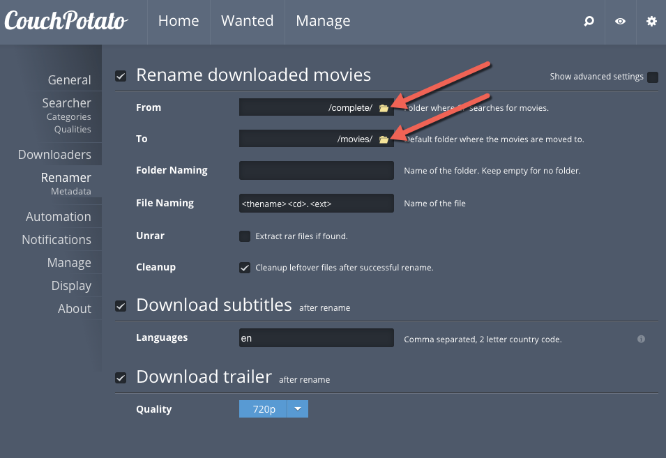

# Overview
Automatic downloading and management of TV and movies is a complicated business.  The complication is not the process itself, but figuring how to “wire up” all of the pieces can be challenging.  This document will walk you through the necessary setup.

The components we will be using can be generalized into two categories:

* Media Managers
* Downloaders

We will also be using a technology called Docker. This requires that the setup be done on a modern Linux system.

# Media Managers
Two popular media managers are:

* Couch Potato (Manages Movies) 
* SickBeard (Manages TV) 

The media managers can be configured to look in a certain directory for new "completed" media.  Then they can post process, rename and move that media to the final destination.

The also search for new media and drop either .torrent or .nzb files into folders for the downloaders to pick up and process.

# Downloaders
Two popular downloaders are:

* SABnzdb (Uses USENET as the source) 
* Transmission (Uses Torrents as the source) 

# Couch Potato - Movies

Using the Couch Potato Web UI, you configure it to connect to Transmission and SABnzdb (via their API), where it would put .torrent or .nzb files to be processed by said downloader.  Usually it will then look in a "completed" folder for new movies and process them.

# Sick Beard - TV

Sick Beard can be configured to use torrent files, but prefers to use USENET.  Explanation here?

# Summary

To summarize, you can get movies with either torrent files or nzb files via Couch Potato which uses Transmission and SABnzdb.  You are suggested to get TV using nzb files via Sick Beard via SABnzdb.
I would think that if you choose to use nzb files for both movies and TV, you should set up different instances of Transmission to separate the media types.

# I want my MEDIA!

To facilitate constructing a personal media management system we will use a Linux server running Docker with customized docker images for each component.


## Linux Server Setup

Setup your Linux box as you normally would and install the Docker deamon.  You will also want to mount any remote file systems that contain your TV and movies.  This mount should be read-write if you want the post processing features like moving new media to it’s location and naming the media properly.

For example this mounts the NFS share on my Mac Pro:

    macpro:/Volumes/16T/media /media nfs defaults,nobootwait 0 0


## User Setup

Next, let’s setup some paths for holding configuration information and data used by the components.  I suggest putting this in the .bash_profile of the user running the Docker containers.


```bash
export BASE=/media/automation
export MOVIE_LIBRARY_DIR=/media/HD
export TV_LIBRARY_DIR=/media/TV

export TRANSMISSION_MOVIES_CONFIG=$BASE/transmission-movies/config
export TRANSMISSION_MOVIES_INCOMPLETE=$BASE/transmission-movies/incomplete
export TRANSMISSION_MOVIES_COMPLETE=$BASE/transmission-movies/complete
export TRANSMISSION_MOVIES_WATCH=$BASE/transmission-movies/watch

export SABNZDB_CONFIG=$BASE/sabnzdb/config
export SABNZDB_DATA=$BASE/sabnzdb/data
export SABNZDB_INCOMPLETE=$BASE/sabnzdb/incomplete
export SABNZDB_COMPLETE=$BASE/sabnzdb/complete
export SABNZDB_WATCH=$BASE/sabnzdb/watch

export COUCHPOTATO_CONFIG=$BASE/couchpotato/config
export COUCHPOTATO_DATA=$BASE/couchpotato/data
export COUCHPOTATO_MOVIES=$MOVIE_LIBRARY_DIR
export COUCHPOTATO_COMPLETE=$TRANSMISSION_MOVIES_COMPLETE

export SICKBEARD_CONFIG=$BASE/sickbeard/config
export SICKBEARD_DATA=$BASE/sickbeard/data
export SICKBEARD_NZB_DIR=$BASE/sickbeard/nzb
export SICKBEARD_TORRENT_DIR=$BASE/sickbeard/torrent
```

Next you can create all of these folders with this script:

```bash
mkdir -p $BASE $TRANSMISSION_MOVIES_CONFIG $TRANSMISSION_MOVIES_INCOMPLETE $TRANSMISSION_MOVIES_COMPLETE $TRANSMISSION_MOVIES_WATCH $SABNZDB_CONFIG $SABNZDB_DATA $SABNZDB_INCOMPLETE $SABNZDB_COMPLETE $COUCHPOTATO_CONFIG $COUCHPOTATO_DATA $COUCHPOTATO_COMPLETE $SICKBEARD_CONFIG $SICKBEARD_DATA $SICKBEARD_NZB_DIR $SICKBEARD_TORRENT_DIR
```

Depending on permissions, you may have to "sudo" and then "chown" the folders.

## Fire up the Containers!!!!

Here is the relationship from a directory perspective:


### Transmission

For the torrent process to work, you need to forward an external port on your firewall to the Linux host running the docker container.

Run this command to start the Transmission service:

```bash
docker run -d \
    -v $TRANSMISSION_MOVIES_WATCH:/watch \
    -v $TRANSMISSION_MOVIES_COMPLETE:/downloads \
    -v $TRANSMISSION_MOVIES_INCOMPLETE:/incomplete \
    -v $TRANSMISSION_MOVIES_CONFIG:/config  \
    -p <your_external_port>:45555 -p 9091:9091 \
    -e "USERNAME=media" -e "PASSWORD=<whatever you want>" --name transmission supercoder/transmission
```

I highly recommend you get this remote GUI: https://code.google.com/p/transmisson-remote-gui/.  You can always use the web interface on port 9091 too.

### SABnzdb

Run this command to start the SABnzdb service:

```bash
docker run -d \
    -v $SABNZDB_CONFIG:/config \
    -v $SABNZDB_DATA:/data \
    -v $SABNZDB_INCOMPLETE:/incomplete \
    -v $SABNZDB_COMPLETE:/complete \
    -p 8080:8080 -p 9090:9090 --name sabnzbd supercoder/sabnzdb
```

Navigate to http://localhost:8080 or wherever the service has been started.

Run through the wizard.  After the wizard completes, you need to configure some other settings.

* Config | Folders
* Temporary Download Folder: /incomplete
* Complete Download Folder: /complete
* Watched folder: /watch
* Generate API Key

#### SABnzdb Configuration Summary

SABnzdb General - Generate an API key here as it will be used in the CouchPotato configuration


SABnzdb Folders - Specify /complete, /incomplete and /watch


SABnzdb Servers - Specify you server(s) here.


### Couch Potato

Run this command to start the Couch Potato service:

```bash
docker run -d  \
    -v $COUCHPOTATO_CONFIG:/config \
    -v $COUCHPOTATO_DATA:/data \
    -v $MOVIE_LIBRARY_DIR:/movies \
    -v $COUCHPOTATO_COMPLETE:/complete \
    -p 5050:5050 --name couchpotato supercoder/couchpotato

```

Navigate to http://localhost:5050 or wherever the service has been started.

You will be presented with the configuration wizard.

* General/Basics/Username: media
* General/Basics/Password: <whatever you want>
* What download apps are you using?
* Uncheck Black Hole
* Check Transmission
* Enter Username/Password and Host
* Check Sabnzdb
* Enter host and the API key
* Add other torrent providers as necessary.
* Uncheck Newznab
* When you are ready, hit the BIG green button.
* Navigate to settings
* Manage,  Movie Library Manager (Add the /movies path)

#### Couch Potato Configuration Summary

This section is pretty "general":


This is where you select where to search for media.  I just used the defaults in this example.


This is where the magic happens.  Configure CouchPotato to use SABnzdb that you previously setup.  You will need to generate an API key and use that name here.  The transmission parameters should be apparent.


More magic here.  You must specify the /complete folder name in the "From" field and /movies in the "To" field.  These directories are mapped appropriately in the Docker image start script.



More magic here.  You must specify the /movies folder name in the "Movie Folder field.  This directory is mapped mapped appropriately in the Docker image start script.


### SickBeard

Run this command to start the SickBeard service:

```bash
docker run -d \
    -v $SICKBEARD_CONFIG:/config  \
    -v $SICKBEARD_DATA:/data \
    -v $SABNZDB_COMPLETE:/complete \
    -v $TV_LIBRARY_DIR:/tv \
    -p 8081:8081 --name sickbeard supercoder/sickbeard
```

Navigate to http://localhost:8081 or wherever the service has been started.

* Home | Add Shows, /tv
* Then run through all the shows you want to add.
* Config | Post-Processing
* TV Download Dir
* Then configure Sickbeard to use SABnzdb

#### SickBeard Configuration Summary

SickBeard - General:  You can generate an API key here if needed.


SickBeard - Search Settings:  This is whre you connect SickBeard to SABnzdb.


SickBeard - Post Processing:  Specify the /complete folder


# Network Ports

|Application   | Default Port |
|--------------|--------------|
| Transmission | 9091         |
| SABnzdb      | 8080, 9090?? |
| Couch Potato | 5050         |
| Sick Beard   | 8081         |


